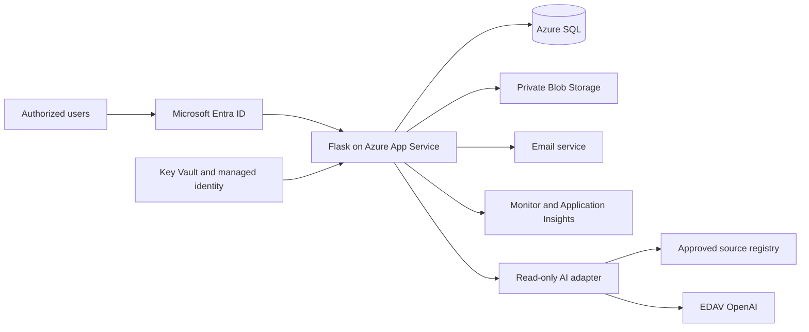

# Competency Assessment Tracker: Architecture One-Pager

**Purpose:** Give the Azure AI platform support team a public-safe technical
summary to review before confirming platform, deployment, and ongoing support.
This document contains no controlled source content, workforce data, secrets,
network details, or production configuration.

## Review outcome requested

Confirm whether the proposed Azure pattern is supportable, identify required
platform changes, and name the owners and approved patterns for provisioning,
deployment, monitoring, incident support, and EDAV OpenAI integration.

## Solution at a glance

| Area | Proposed baseline | Responsibility |
| --- | --- | --- |
| Identity | Microsoft Entra ID | Authenticate users and supply approved role/group claims |
| Application | Server-rendered Python Flask on Azure App Service | Enforce authorization, workflow, validation, reporting, and audit orchestration |
| Structured records | Azure SQL | Store assignments, assessments, signatures, status, notifications, and audit references |
| Documents | Private Azure Blob Storage | Retain approved artifacts with version and SHA-256 integrity metadata |
| Communication | Approved email service | Send minimal-content notices with secure application links and delivery history |
| Platform controls | Managed identity, Key Vault, Azure Monitor, Application Insights | Protect service access and secrets; provide telemetry, logs, alerts, and operational evidence |
| Knowledge assistance | Separate read-only adapter using EDAV OpenAI | Answer supported questions from approved sources with citations and SME escalation |

## Controlled workflow and authority

1. The Assessor documents the assessment and required follow-up.
2. Testing Personnel reviews and signs; this signature is the current employee
   acknowledgement event.
3. The authorized Technical Supervisor/final signer reviews and signs.
4. The system finalizes and locks the approved record version.

Administrative membership never grants assessment, signature, or approval
authority. SQUAD Admins manage application configuration and operational views.
Platform Admins have continuous, attributable, least-privilege diagnostic/read
access across environments so they can investigate failures, but they cannot
perform ordinary workflow mutations. Necessary corrections use a separately
authorized repair or amendment process that preserves the original record and
audit history.

## Security, records, and AI boundaries

- Authorization is enforced server-side for every record and action; team and
  role scoping applies to views, exports, and document retrieval.
- Production records and exports are treated as sensitive workforce records.
- Finalized records are not overwritten; attributable amendments preserve
  prior versions and audit history.
- Email contains no assessment results or other unnecessary sensitive content.
- The AI capability cannot assess, score, approve, sign, notify, or modify an
  official record. It uses only active approved sources and cites them; an
  unsupported question is routed to an SME.
- The current QMML/NCIRD file remains a link index. Acquisition and versioning
  of the complete authorized source corpus are pending and are not assumed by
  this architecture.

## Platform review checklist

The Azure AI platform support team should confirm:

- App Service runtime, deployment, scaling, health-check, and support patterns.
- Entra application registration, group/role claims, and access-review ownership.
- Managed-identity access to SQL, Blob, Key Vault, monitoring, email, and EDAV
  OpenAI, including approved network boundaries.
- SQL backup/recovery, Blob retention, logging destinations, alert routing, and
  evidence available for incident review.
- Supported EDAV OpenAI integration, source/context limits, content safeguards,
  evaluation expectations, and operational telemetry.
- Development, test, and production ownership; deployment approvals; incident
  escalation; and the controlled repair/amendment procedure.

Production networking, retention/disposition, privacy and security assessment,
authorized source acquisition, notification cadence, and authority to operate
remain subject to the appropriate CDC and EDAV owners.

## Governing references

The controlled Competency Assessment Tracker Project Plan governs product scope
and workflow. The controlled App Architecture and Implementation Guide governs
technical implementation. Obtain authorized copies through the approved
document channel and verify their metadata using
[`../SOURCE_MANIFEST.md`](../SOURCE_MANIFEST.md).
